# Amazon Returns & AI Vision Grading Platform 🚚🤖

> **Enterprise-Grade Automated Reverse Logistics, Multi-View AI Condition Assessment, and Circular Economy Routing Platform**

[](https://amazon-hackon-livid.vercel.app/)
[](https://amazon-grading-backend.onrender.com/health)
[](https://ai-grading-dlga.onrender.com)
[](https://supabase.com/)
[](LICENSE)

---

## 🌐 Live Production Deployment

- 🌐 **Web Application (Frontend)**: [https://amazon-hackon-livid.vercel.app/](https://amazon-hackon-livid.vercel.app/)
- ⚙️ **Core Backend API**: [https://amazon-grading-backend.onrender.com](https://amazon-grading-backend.onrender.com/health)
- 🤖 **AI Vision Microservice**: [https://ai-grading-dlga.onrender.com](https://ai-grading-dlga.onrender.com)
- 📁 **GitHub Repository**: [https://github.com/Abhay-2309/AI-Grading.git](https://github.com/Abhay-2309/AI-Grading.git)

---

## 📌 Executive Summary

Modern e-commerce platforms handle millions of product returns daily, incurring billions in logistics costs, manual processing delays, and return fraud. 

The **Amazon Returns & AI Grading Platform** is a production-ready, microservices-based logistics platform designed to automate item condition grading, field verification, fraud mitigation, and circular economy inventory routing.

When a customer initiates a return, multi-angle physical evidence is analyzed by a **Computer Vision Pipeline (Google Gemini 2.5 Flash / Gemma 4)** combined with a **Deterministic Rules & Band-Edge Voting Engine**. Items are graded (`A+` to `F`), assigned a confidence score, and automatically routed to **Restock**, **Refurbish**, **P2P Resale (MarketConnect)**, or **NGO Donation (MarketConnect Cares)**.

---

## 🏗️ Enterprise System Architecture

```
                                 ┌───────────────────────────────────┐
                                 │       Frontend SPA (Vite/React)   │
                                 │  https://amazon-hackon.vercel.app │
                                 └─────────────────┬─────────────────┘
                                                   │ HTTPS / REST
                                                   ▼
                                 ┌───────────────────────────────────┐
                                 │     Backend API (Express.js)      │
                                 │ https://amazon-grading.onrender   │
                                 └────────┬─────────────────┬────────┘
                                          │                 │
                  Prisma ORM / PostgreSQL │                 │ Server-to-Server Proxy
                  (Supabase Session Pool) │                 │ (Multipart / JSON)
                                          ▼                 ▼
                              ┌──────────────────┐   ┌──────────────────┐
                              │ Supabase DB      │   │ AI Microservice  │
                              │ (PostgreSQL 15)  │   │ (Fastify / TS)   │
                              └──────────────────┘   └────────┬─────────┘
                                                              │
                                            ┌─────────────────┼─────────────────┐
                                            ▼                 ▼                 ▼
                                    ┌───────────────┐ ┌───────────────┐ ┌───────────────┐
                                    │ AWS S3        │ │ AWS DynamoDB  │ │ Google Gemini │
                                    │ (Photo Bucket)│ │ (State Audit) │ │ (Primary AI)  │
                                    └───────────────┘ └───────────────┘ └───────┬───────┘
                                                                                │ Fallback
                                                                                ▼
                                                                        ┌───────────────┐
                                                                        │ Google Gemma  │
                                                                        │ (Fallback AI) │
                                                                        └───────────────┘
```

### Key Architectural Constraints & Guarantees
1. **Backend Gateway & Single Authority**: Frontend never connects directly to the AI microservice or AWS resources. Backend acts as the API Gateway, handling authentication, business logic, and database persistence.
2. **Stateless AI Processing**: The AI microservice (`AI1`) accepts multipart requests, archives original and processed images to S3, updates DynamoDB audit records, runs async vision analysis, and returns presigned image links.
3. **Resilience & Circuit Breaker**: If primary Vision AI (Gemini) encounters rate limits or quota caps (~20 req/day on free tier), a Circuit Breaker pattern automatically fails over to Gemma without user disruption.

---

## 💻 Tech Stack & Component Ecosystem

| Component | Technology | Version | Purpose |
|---|---|---|---|
| **Frontend** | React 19, Vite 8, Tailwind CSS 4 | `19.2.7` / `8.1.1` | Single Page Web Application (7 Portals) |
| **Backend API** | Node.js, Express.js, Prisma ORM | `20+` / `4.19.2` | Core business logic, data persistence, API proxy |
| **AI Service** | Fastify, TypeScript, Sharp, Zod | `4.28.0` / `5.7.2` | Image validation, pHash dedup, AI orchestration |
| **Vision Models**| Google Gemini 2.5 Flash, Gemma 4 | `0.21.0` (SDK) | Multi-view defect detection & rubric assessment |
| **Database** | PostgreSQL (Supabase) | `15.0` | Primary relational database (Prisma Client) |
| **Cloud Storage**| AWS S3 & AWS DynamoDB | `@aws-sdk/v3` | Image storage & async grading execution log |
| **Deployment** | Vercel (Frontend), Render (APIs) | Cloud | Serverless & Containerized Web Services |

---

## 🎯 The 7 Integrated User Portals

The application presents an integrated multi-persona dashboard accessible from a central Gateway:

| Portal | Role & Purpose | Key Technical Features |
|---|---|---|
| **👤 Customer Portal** | Initiate returns & upload evidence | Required multi-angle upload, interactive condition survey, real-time AI report, instant refund estimate |
| **🚚 Pickup Agent App** | Field agent verification app | Daily route management, field grade verification, disagreement flagging, end-of-shift accuracy metric |
| **🛡️ Operations Hub** | Fraud guard & manual review console | AI-vs-Agent disagreement queue, risk scoring, automated inventory routing, agent leaderboard |
| **👗 Fitting & Try-On** | Return prevention suite | AI Virtual Try-On, shoe size finder (powered by past purchase history) |
| **🛒 MarketConnect P2P**| Graded return resale marketplace | Peer-to-peer resale of B/C/D grade returns, seller chat, green credit unlocks |
| **💚 MarketConnect Cares**| NGO donation pipeline | Direct product donations to verified NGO campaigns, Green Credit rewards |
| **🏛️ NGO Dashboard** | NGO campaign administration | Post item needs, track campaign progress, receive verified donation shipments |

---

## 🔬 AI Grading & Rules Engine Pipeline

The AI microservice combines deep vision analysis with a deterministic rules engine to prevent AI hallucinations and guarantee grading fairness:

```mermaid
flowchart LR
    A["📸 Multi-Angle Photos"] --> B["Intake & pHash Dedup"]
    B --> C["Upload to S3"]
    C --> D["Gemini / Gemma Vision Pass"]
    D --> E["N=3 Majority Voting"]
    E --> F["Cross-View Dedup"]
    F --> G["Deterministic Rules Engine"]
    G --> H["Grade Cap Rules<br/>(Water→F, Crack→D)"]
    H --> I["Confidence Calculation"]
    I --> J["Final Report & Presigned URLs"]
```



### 1. Multi-Angle Verification
Requires category-specific required angles (e.g. 6-view front/back/left/right/top/bottom for electronics, 2-view front/back for apparel).

### 2. Multi-Pass Majority Voting ($N=3$)
To prevent single-inference variance, 3 detection passes run concurrently. Defect detections are merged using majority voting logic.

### 3. Band-Edge Boundary Re-Run
If an item's score lands within $\pm 3$ points of a letter grade boundary (e.g., score of 89 near the 88 boundary between A and B+), an additional voting pass triggers automatically.

### 4. Hard Grade Caps
Raw model output cannot override strict physical safety & quality rules:
- ❌ **Water Damage** $\rightarrow$ Forced Grade `F`
- ❌ **High/Critical Screen Crack or Tampering** $\rightarrow$ Forced Grade `D`
- ❌ **Customer-Admitted Functional Failure** $\rightarrow$ Forced Grade `C`
- ❌ **Low Photo Quality ($<50\%$)** $\rightarrow$ Capped at `B` + Flagged for Human Review

---

## 🗄️ Database Entity Schema (Prisma PostgreSQL)

```prisma
datasource db {
  provider = "postgresql"
  url      = env("DATABASE_URL")
}

model Profile {
  id                String            @id @default(uuid())
  email             String            @unique
  fullName          String?
  greenCredits      Int               @default(320)
  treesPlanted      Int               @default(14)
  causesHelped      Int               @default(8)
  returns           Return[]
  p2pProducts       P2pProduct[]
  donationHistory   DonationHistory[]
}

model Return {
  id                    String    @id
  itemName              String
  category              String
  price                 Decimal   @db.Decimal(10, 2)
  status                String    @default("Pending")
  userGrade             String?
  userConfidence        String?
  defects               Json      @default("[]")
  agentGrade            String    @default("")
  routing               String?   // Restock, Refurbish, P2P, Donation
  aiRequestId           String?
  aiStatus              String?
  aiRequiresHumanReview Boolean   @default(false)
  createdAt             DateTime  @default(now())
}
```

---

## ⚡ API Endpoints Reference

### Core Backend (`:5000`)
- `GET  /health` - Health check endpoint
- `GET  /api/returns` - List all return records
- `PUT  /api/returns/:id` - Update return status / agent grade
- `POST /api/returns/submit` - Finalize customer return
- `POST /api/grading/:returnId/submit` - Submit photos to AI grading proxy
- `GET  /api/grading/:returnId/status` - Poll grading execution status
- `GET  /api/grading/:returnId/result` - Fetch complete AI report & presigned image URLs
- `GET  /api/p2p/products` - List peer-to-peer resale products
- `POST /api/donations/donate` - Submit item donation & earn Green Credits

### AI Microservice (`:3000`)
- `POST /grade` - Multipart intake, validation, S3 storage, async pipeline enqueue
- `GET  /status/:requestId` - Query current status (`VALIDATED`, `ANALYZING`, `GRADED`, `COMPLETED`, `FAILED`)
- `GET  /result/:requestId` - Fetch final rubric report + presigned S3 URLs

---

## 🚀 Local Development Setup

### 1. Prerequisites
- Node.js $\ge 20.0.0$
- npm $\ge 10.0.0$
- PostgreSQL instance (or Supabase project)

### 2. Environment Setup

#### `Backend/.env`
```env
PORT=5000
DATABASE_URL="postgresql://postgres:<password>@<host>:5432/postgres?schema=public&connect_timeout=30"
AI1_BASE_URL="http://localhost:3000"
```

#### `AI1/.env`
```env
PORT=3000
NODE_ENV=development
AWS_REGION=ap-south-1
AWS_ACCESS_KEY_ID=your_key
AWS_SECRET_ACCESS_KEY=your_secret
S3_BUCKET_NAME=ai-grading-returns
DYNAMODB_TABLE_NAME=AIGradingRequests
GEMINI_API_KEY=your_gemini_key
GEMINI_MODEL=gemini-2.5-flash
```

#### `Frontend/.env.local`
```env
VITE_API_BASE_URL=http://localhost:5000
```

### 3. Starting Services

Open three terminal windows:

```bash
# Terminal 1: AI Microservice
cd AI1
npm install
npm run dev

# Terminal 2: Core Backend API
cd Backend
npm install
npx prisma generate
npx prisma db push
node prisma/seed.js
npm run dev

# Terminal 3: Frontend Web Application
cd Frontend
npm install
npm run dev
```

Navigate to **http://localhost:5173** in your web browser.

---

## 🛡️ Security & Reliability Provisions

1. **Environment Isolation**: Production credentials (AWS, Supabase, Gemini API keys) are strictly managed via platform environment variables (Vercel & Render Secrets).
2. **Automated Reconnection**: Database pooler strings use explicit connection & pool timeouts to handle transient serverless drops.
3. **Graceful Shutdown**: The Fastify AI service intercepts `SIGTERM` and `SIGINT` signals to allow active grading pipelines to finish before exiting.

---

## 📄 License & Ownership

Developed for the **Amazon HackOn Logistics & AI Innovation Challenge**. Distributed under the **MIT License**.
