# Complete Project Architecture — All-in-One Diagram

> [!TIP]
> This is a single all-encompassing diagram. Copy the Mermaid code block into [mermaid.live](https://mermaid.live) and export as PNG/SVG for your PPT.

```mermaid
graph TB
    %% ═══════════════════════════════════════════
    %% CLIENT LAYER — 7 Portals
    %% ═══════════════════════════════════════════
    subgraph FRONTEND["🖥️ FRONTEND — React 19 + Vite 8 + Tailwind 4 (Port :5173)"]
        direction TB
        GW["🏠 Gateway Screen"]

        subgraph PORTALS["Seven User Portals"]
            direction LR
            CP["👤 Customer Portal<br/>Return item, upload photos,<br/>AI grading, refund estimate"]
            PA["🚚 Pickup Agent<br/>Field verification,<br/>AI vs agent grade"]
            OH["🛡️ Operations Hub<br/>Manual review, risk scoring,<br/>routing, leaderboard"]
            FT["👗 Fitting & Try-On<br/>Virtual try-on,<br/>shoe size finder"]
            MC["🛒 MarketConnect P2P<br/>Resale marketplace,<br/>buy/sell/chat"]
            DC["💚 MarketConnect Cares<br/>NGO donations,<br/>Green Credits"]
            ND["🏛️ NGO Dashboard<br/>Post needs,<br/>track fulfillment"]
        end

        API_LAYER["📡 API Layer — useGlobalState() Hook<br/>apiFetch() → all Backend endpoints"]
        
        GW --> CP & PA & OH & FT & MC & DC & ND
        CP & PA & OH & MC & DC & ND --> API_LAYER
    end

    %% ═══════════════════════════════════════════
    %% BACKEND LAYER — Express + Prisma
    %% ═══════════════════════════════════════════
    subgraph BACKEND["⚙️ BACKEND — Express.js + Prisma ORM (Port :5000)"]
        direction TB
        
        subgraph ROUTES["REST API Routes"]
            direction LR
            R_RET["/api/returns<br/>GET / PUT<br/>POST /submit"]
            R_GRADE["/api/grading/:id<br/>POST /submit<br/>GET /status<br/>GET /result"]
            R_P2P["/api/p2p<br/>/products GET/POST<br/>/chats GET/POST<br/>/messages POST"]
            R_DON["/api/donations<br/>/campaigns GET/POST/PATCH<br/>/donate POST<br/>/redeem POST"]
            R_PROF["/api/profile<br/>GET profile<br/>GET /leaderboard"]
            R_CFG["/api/config<br/>GET /subcategories"]
            R_TRY["/api/tryon<br/>POST /analyze<br/>POST /size-finder"]
        end

        PRISMA["Prisma ORM Client"]
        PROXY_LOGIC["AI1 Proxy Logic<br/>Forward multipart → AI1<br/>Persist grade on Return row"]
    end

    %% ═══════════════════════════════════════════
    %% AI MICROSERVICE LAYER
    %% ═══════════════════════════════════════════
    subgraph AI1["🤖 AI1 SERVICE — Fastify + TypeScript (Port :3000)"]
        direction TB
        
        subgraph AI_API["AI API Endpoints"]
            direction LR
            AG["POST /grade<br/>(multipart upload)"]
            AS["GET /status/:id<br/>(poll progress)"]
            AR["GET /result/:id<br/>(full report + URLs)"]
        end

        subgraph PIPELINE["🔬 Grading Pipeline"]
            direction TB
            VAL["Image Validation<br/>file-type, size, pHash dedup"]
            S3UP["S3 Archive<br/>original + analysis copy"]
            
            subgraph DETECTION["Detection Phase (N=3 voting runs)"]
                direction LR
                ORCH["FallbackOrchestrator<br/>Circuit Breaker Pattern"]
                PROMPT["Prompt Builder<br/>Category-aware rubric"]
                REPAIR["Repair & Validate<br/>JSON parse + Zod schema"]
            end

            subgraph SCORING["Deterministic Grading Engine"]
                direction LR
                VOTE["Vote-Merge<br/>Majority voting"]
                DEDUP["Cross-View<br/>Deduplication"]
                VSCORE["Vision Score<br/>Weighted damage table"]
                RSCORE["Reason Score<br/>Return reason analysis"]
                QSCORE["Question Score<br/>Condition answers"]
                BLEND["Score Blending<br/>Photo-quality weighted"]
                GRADE_MAP["Grade Mapping<br/>A+(95) → F(0)"]
                CAPS["Grade Caps<br/>Water→F, Crack→D<br/>Tamper→D, Missing→C"]
                CONF["Confidence Calc<br/>Min across components"]
                HUMAN["Human Review<br/>Flags & Triggers"]
            end
        end

        VAL --> S3UP --> DETECTION
        ORCH --> PROMPT --> REPAIR
        DETECTION --> VOTE --> DEDUP
        DEDUP --> VSCORE --> BLEND
        RSCORE --> BLEND
        QSCORE --> BLEND
        BLEND --> GRADE_MAP --> CAPS --> CONF --> HUMAN
    end

    %% ═══════════════════════════════════════════
    %% CLOUD INFRASTRUCTURE
    %% ═══════════════════════════════════════════
    subgraph CLOUD["☁️ CLOUD INFRASTRUCTURE"]
        direction TB
        
        subgraph SUPABASE["Supabase (Managed PostgreSQL)"]
            DB[("🐘 PostgreSQL<br/>Connection Pooler<br/>IPv4 dual-stack")]
            subgraph TABLES["Database Tables"]
                direction LR
                T_PROF["profiles"]
                T_RET["returns"]
                T_P2P["p2p_products<br/>p2p_chats<br/>p2p_messages"]
                T_NGO["ngo_campaigns<br/>donation_history"]
                T_LB["leaderboard"]
                T_PH["purchase_history"]
            end
        end

        subgraph AWS["Amazon Web Services"]
            direction LR
            S3["📦 S3 Bucket<br/>Product photo archive<br/>Presigned URLs"]
            DDB["📋 DynamoDB<br/>Grading request records<br/>Status tracking"]
        end

        subgraph GOOGLE_AI["Google AI Platform"]
            direction LR
            GEMINI["✨ Gemini API<br/>Primary Vision Model<br/>~20 req/day free tier"]
            GEMMA["🔮 Gemma API<br/>Fallback Vision Model<br/>Slower, unlimited"]
        end
    end

    %% ═══════════════════════════════════════════
    %% CIRCULAR ECONOMY OUTPUT
    %% ═══════════════════════════════════════════
    subgraph CIRCULAR["♻️ CIRCULAR ECONOMY OUTPUT"]
        direction LR
        RESTOCK["📦 Restock<br/>(Grade A+/A)"]
        REFURB["🔧 Refurbish<br/>(Grade B+/B)"]
        RESALE["🛒 P2P Resale<br/>(Grade C/D)"]
        DONATE["💚 NGO Donate<br/>(Any grade)"]
        CREDITS["🌱 Green Credits<br/>Earned & Redeemed"]
    end

    %% ═══════════════════════════════════════════
    %% CONNECTIONS
    %% ═══════════════════════════════════════════

    %% Frontend → Backend
    API_LAYER -->|"REST API<br/>JSON + Multipart<br/>fetch()"| ROUTES

    %% Backend internal
    R_RET & R_P2P & R_DON & R_PROF & R_CFG & R_TRY --> PRISMA
    R_GRADE --> PROXY_LOGIC

    %% Backend → DB
    PRISMA -->|"SQL queries"| DB
    DB --- T_PROF & T_RET & T_P2P & T_NGO & T_LB & T_PH

    %% Backend → AI1 (proxy)
    PROXY_LOGIC -->|"Server-to-server<br/>HTTP forward"| AI_API

    %% AI1 → Cloud
    S3UP -->|"putObject"| S3
    AR -->|"getSignedUrl"| S3
    AG -->|"put record"| DDB
    AS -->|"get record"| DDB
    HUMAN -->|"update record"| DDB

    %% AI1 → Vision Models
    ORCH -->|"generateContent<br/>vision prompt + image"| GEMINI
    ORCH -.->|"Fallback<br/>(quota/error)"| GEMMA

    %% Grading → Circular Economy
    HUMAN -->|"Routing<br/>Decision"| RESTOCK & REFURB & RESALE & DONATE
    RESALE --> CREDITS
    DONATE --> CREDITS

    %% ═══════════════════════════════════════════
    %% STYLING
    %% ═══════════════════════════════════════════
    style FRONTEND fill:#0D1B2A,stroke:#61DAFB,color:#fff,stroke-width:2px
    style BACKEND fill:#1B2D1B,stroke:#68A063,color:#fff,stroke-width:2px
    style AI1 fill:#2D1B1B,stroke:#FF6B6B,color:#fff,stroke-width:2px
    style CLOUD fill:#1A1A2E,stroke:#E0E0E0,color:#fff,stroke-width:2px
    style CIRCULAR fill:#1B2D1B,stroke:#4CAF50,color:#fff,stroke-width:2px

    style GW fill:#FF9900,stroke:#333,color:#000
    style CP fill:#0073BB,stroke:#333,color:#fff
    style PA fill:#FF9900,stroke:#333,color:#000
    style OH fill:#DD2C00,stroke:#333,color:#fff
    style FT fill:#E91E63,stroke:#333,color:#fff
    style MC fill:#4CAF50,stroke:#333,color:#fff
    style DC fill:#2E7D32,stroke:#333,color:#fff
    style ND fill:#1565C0,stroke:#333,color:#fff

    style R_GRADE fill:#FF6B6B,stroke:#333,color:#fff
    style PROXY_LOGIC fill:#FF6B6B,stroke:#333,color:#fff
    style PRISMA fill:#2D3748,stroke:#68A063,color:#fff

    style DB fill:#336791,stroke:#333,color:#fff
    style S3 fill:#FF9900,stroke:#333,color:#000
    style DDB fill:#4053D6,stroke:#333,color:#fff
    style GEMINI fill:#8E24AA,stroke:#333,color:#fff
    style GEMMA fill:#AB47BC,stroke:#333,color:#fff

    style ORCH fill:#FF9800,stroke:#333,color:#000
    style CAPS fill:#D32F2F,stroke:#333,color:#fff
    style VOTE fill:#1976D2,stroke:#333,color:#fff
    style HUMAN fill:#FF6B00,stroke:#333,color:#fff

    style RESTOCK fill:#4CAF50,stroke:#333,color:#fff
    style REFURB fill:#FF9800,stroke:#333,color:#000
    style RESALE fill:#2196F3,stroke:#333,color:#fff
    style DONATE fill:#2E7D32,stroke:#333,color:#fff
    style CREDITS fill:#FFD600,stroke:#333,color:#000
```

---

### What This Diagram Covers (Everything in One)

| Layer | Contents |
|---|---|
| **Client Layer** | All 7 portals (Customer, Pickup Agent, Ops Hub, Try-On, MarketConnect P2P, MarketConnect Cares, NGO Dashboard) + API hook |
| **Backend Layer** | All 7 API route groups (`/returns`, `/grading`, `/p2p`, `/donations`, `/profile`, `/config`, `/tryon`) + Prisma ORM + AI1 proxy |
| **AI Microservice** | 3 endpoints (`/grade`, `/status`, `/result`) + full pipeline: Validation → S3 Archive → Detection (Orchestrator + Prompt Builder + Repair) → Voting → Dedup → 5-channel Scoring → Grade Mapping → Grade Caps → Confidence → Human Review |
| **Cloud Infrastructure** | PostgreSQL/Supabase (all 9 tables), AWS S3, AWS DynamoDB, Google Gemini (primary), Google Gemma (fallback) |
| **Circular Economy** | Restock / Refurbish / P2P Resale / NGO Donation routing + Green Credits loop |
| **Data Flows** | Frontend→Backend (REST), Backend→AI1 (proxy), AI1→AWS (S3/DynamoDB), AI1→Google AI (Gemini/Gemma), Backend→Postgres (Prisma), Grading→Routing |
