# Amazon Returns & AI Grading Platform — PPT Diagrams

---

## 0. Complete Solution Flow — The Whole Story in One Diagram

> Use this one as the "Our Solution" / "How We Solve This" slide — it's the narrative flow, not the tech stack. The detailed technical diagrams below back it up.

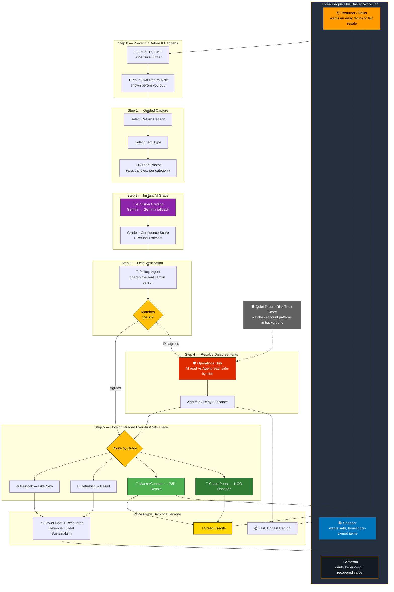

**How to read it:** start top-left with the three people the whole system has to satisfy. Follow the return down through prevention, guided capture, instant AI grading, and field verification. Most items agree and go straight to routing; anything that disagrees goes to the Operations Hub first. Every item ends up somewhere useful — never landfill — and the value (refund, green credits, recovered cost) flows back up to all three people at the bottom.

---

## 1. High-Level System Architecture

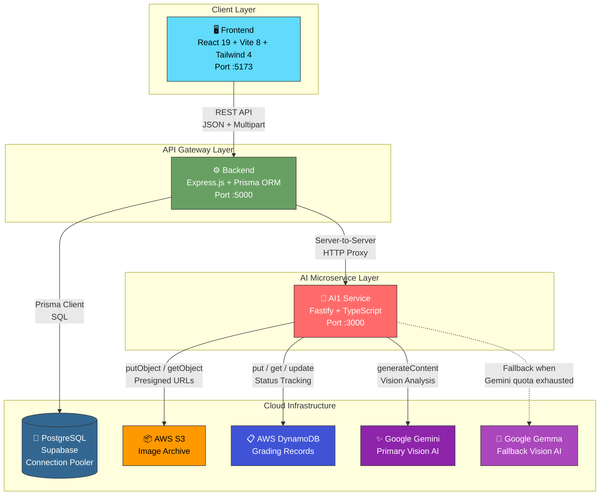

---

## 2. Seven-Portal User Interface Map

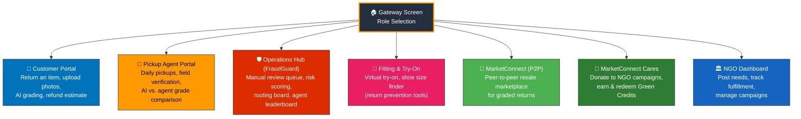

---

## 3. End-to-End Return & Grading Data Flow

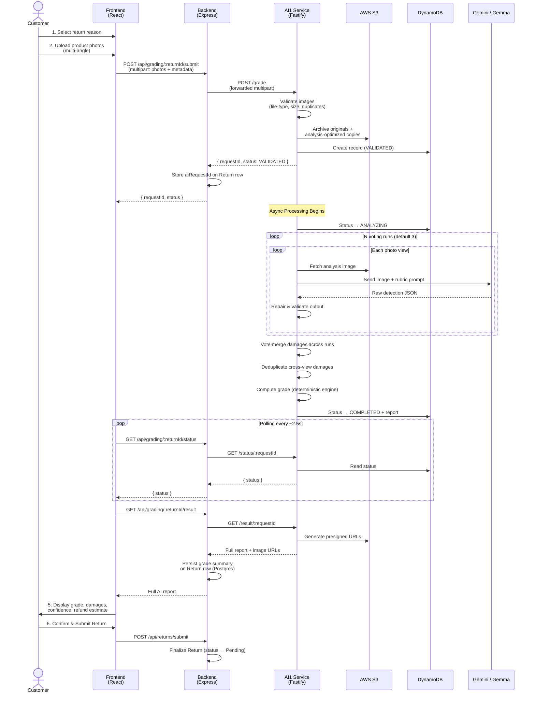

---

## 4. AI Grading Pipeline — Internal Architecture

```mermaid
flowchart TB
    subgraph "Intake & Validation"
        A["POST /grade<br/>Multipart Upload"] --> B["Image Validation<br/>(file-type, size, pHash dedup)"]
        B --> C["Archive to S3<br/>(original + analysis copy)"]
        C --> D["Create DynamoDB Record<br/>(status: VALIDATED)"]
    end

    subgraph "Detection Phase"
        D --> E["Load images from S3"]
        E --> F["Per-View Detection<br/>(concurrent Promise.allSettled)"]
        F --> G{"Primary: Gemini<br/>Circuit Breaker?"}
        G -->|Closed| H["Gemini Vision API<br/>+ Rubric Prompt"]
        G -->|Open / Quota Error| I["Gemma Fallback<br/>Vision API"]
        H --> J["Repair & Validate<br/>(JSON parse, Zod schema)"]
        I --> J
        J -->|Invalid| K["Re-prompt Model<br/>(with error feedback)"]
        K --> J
        J -->|Valid| L["DetectionResult<br/>(damages, quality, match)"]
    end

    subgraph "Voting & Dedup (N=3 runs)"
        L --> M["Run N detection passes"]
        M --> N["Vote-Merge Damages<br/>(majority voting)"]
        N --> O["Cross-View Dedup<br/>(same damage, different angles)"]
    end

    subgraph "Deterministic Grading Engine"
        O --> P["Vision Score<br/>(weighted damage table)"]
        P --> Q["Reason Score<br/>(return reason analysis)"]
        Q --> R["Question Score<br/>(condition answers)"]
        R --> S["Blend Scores<br/>(photo-quality-weighted)"]
        S --> T["Map to Grade<br/>(A+ → F bands)"]
        T --> U["Apply Grade Caps<br/>(water damage→F, crack→D, etc.)"]
        U --> V["Confidence Calc<br/>(min across components)"]
        V --> W{"Near Band Edge?<br/>(±3 points)"}
        W -->|Yes, N=1| X["Re-run with N=3"]
        X --> N
        W -->|No| Y["Final Report"]
        Y --> Z["Human Review Flags<br/>(wrong item, mismatch,<br/>low confidence, band edge)"]
    end

    Z --> AA["DynamoDB: COMPLETED<br/>+ Final Report"]

    style A fill:#4CAF50,stroke:#333,color:#fff
    style G fill:#FF9800,stroke:#333,color:#000
    style H fill:#8E24AA,stroke:#333,color:#fff
    style I fill:#AB47BC,stroke:#333,color:#fff
    style N fill:#1976D2,stroke:#333,color:#fff
    style U fill:#D32F2F,stroke:#333,color:#fff
    style AA fill:#2E7D32,stroke:#333,color:#fff
```

---

## 5. Database Schema (Entity Relationship Diagram)

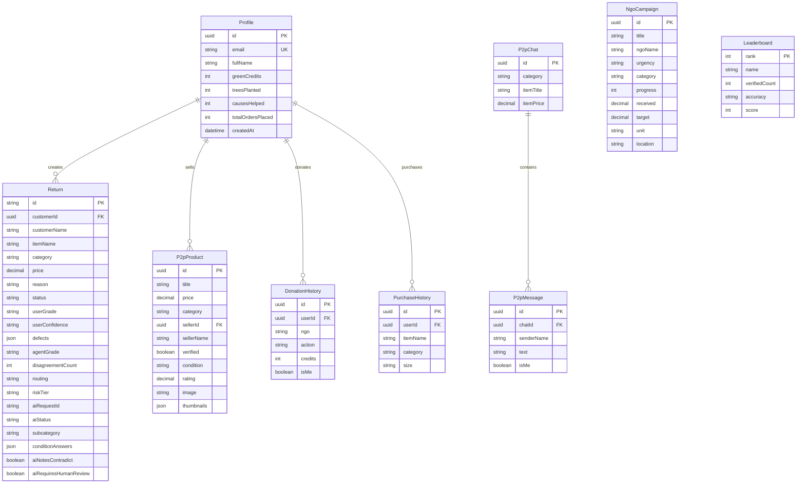

---

## 6. API Route Architecture

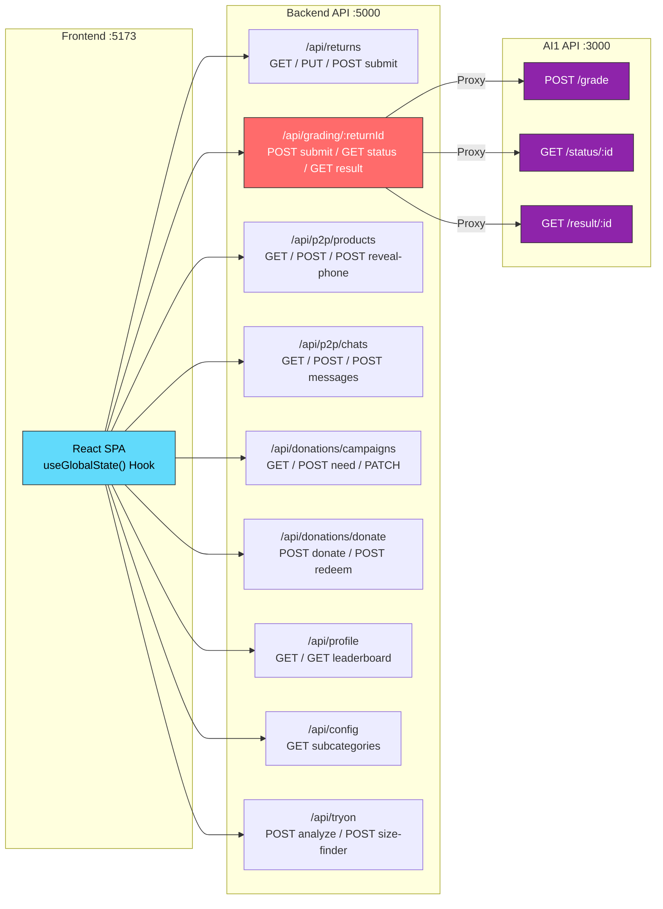

---

## 7. Customer Return User Journey Flow

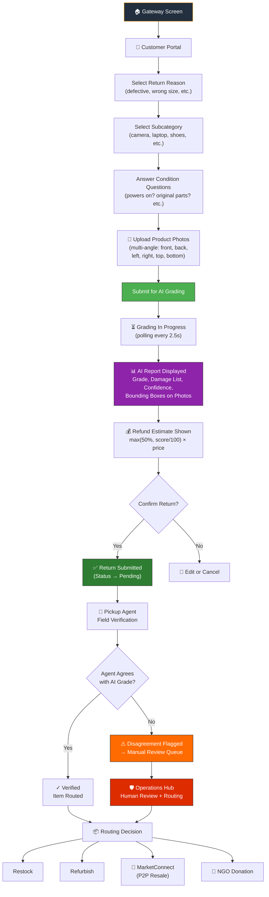

---

## 8. Technology Stack Overview

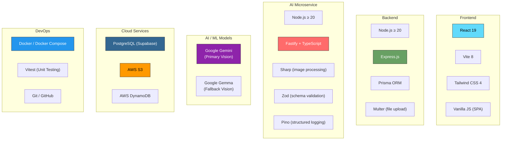

---

## 9. Grading Scale & Deterministic Rules

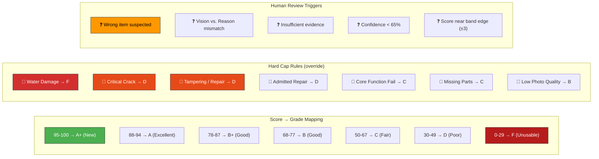

---

## 10. Circular Economy / Sustainability Flow

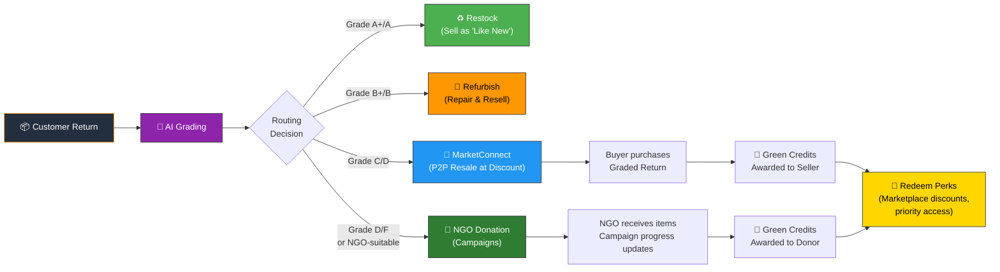

---

## 11. Deployment Topology

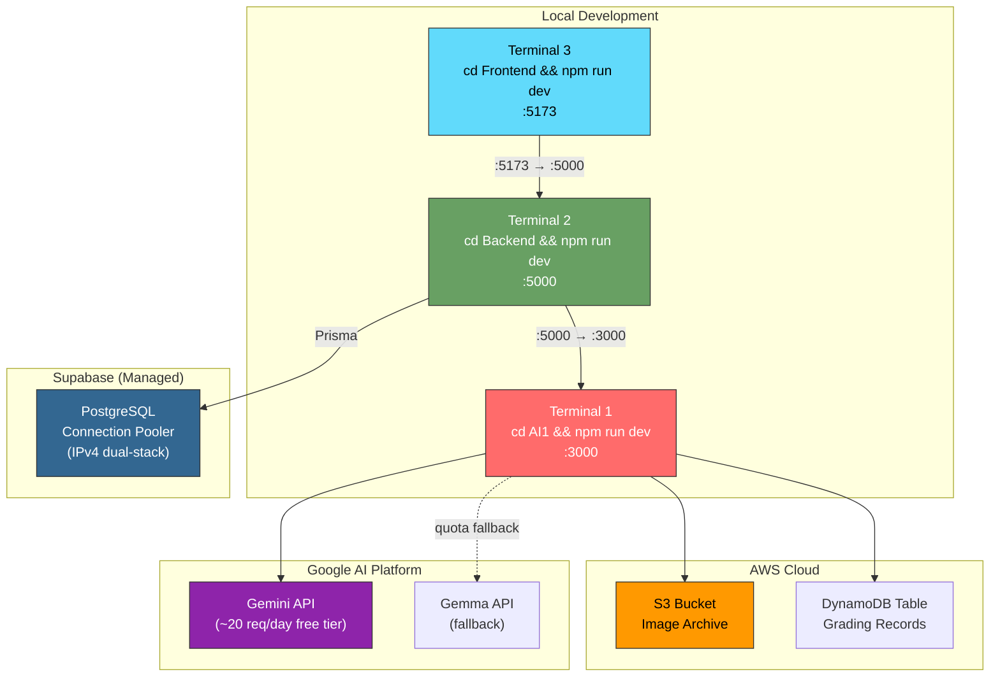

---

## 12. AI Model Resilience — Circuit Breaker Pattern

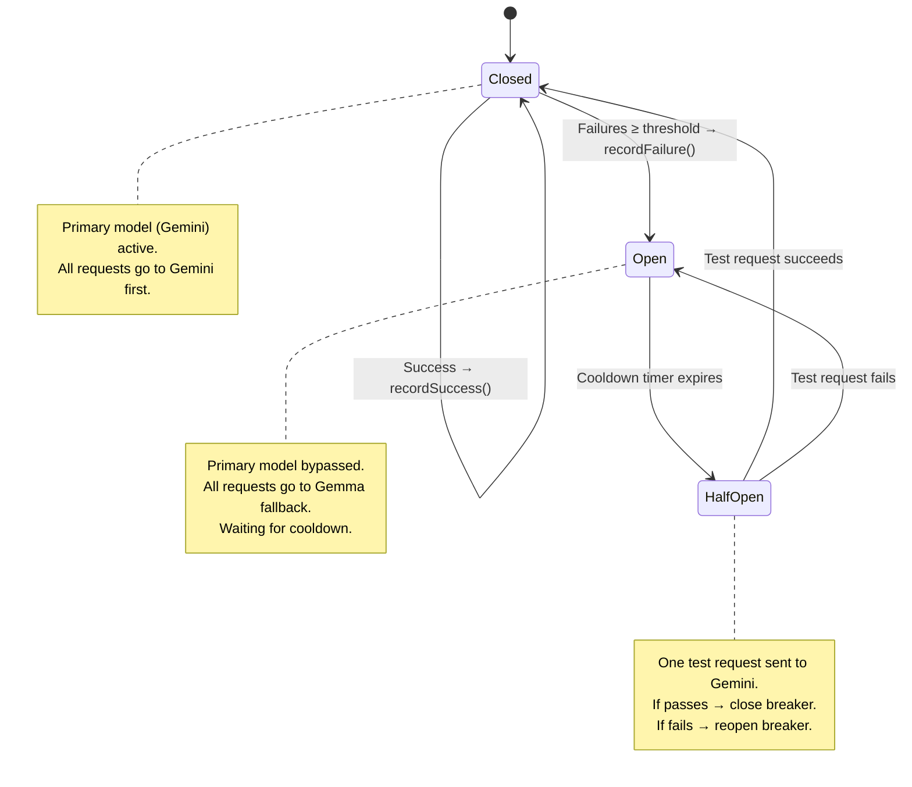

---

> [!TIP]
> **For your PPT**: Each diagram above is rendered as a Mermaid diagram. You can:
> 1. **Screenshot** them directly from this preview
> 2. Copy the Mermaid code into [mermaid.live](https://mermaid.live) to export as PNG/SVG
> 3. Use the Mermaid CLI (`mmdc`) to batch-export all diagrams
